# Deploy Website Forever With $1

## [Youtube](https://youtu.be/eCwh39uUs3k) - [Medium](https://medium.com/@heaty566/deploy-website-forever-with-1-7a6e54e5456f)

## 1. Preparing

- NextJS Project or HTML static
- A domain

## 2. Buying a domain

I recommend buying a new domain in https://sg.godaddy.com, because they provide a well-being experience with fast DNS forwarding and support.

## 3. Deploying your website by GitHub page

### 3.1 HTML Static Project

Note:
you must name your first HTML file as index.html, because it's the default file that the server will respond to when someone accesses your website

1. Create a project and init GitHub repository
2. Push your code to GitHub
3. Go to the "Settings" section in your project repository

   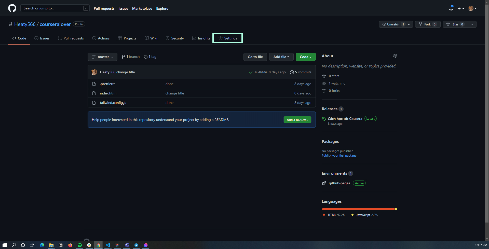

4. Click to the "Pages" section

   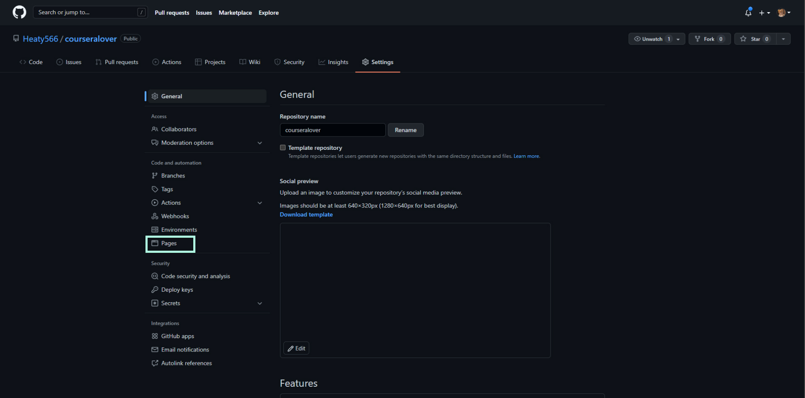

5. Select the branch you want to deploy

   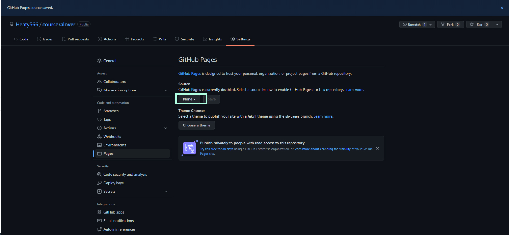

   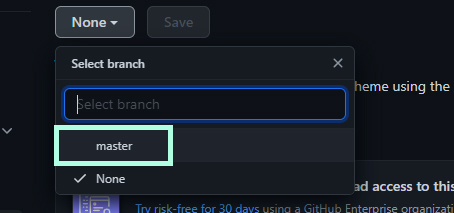

   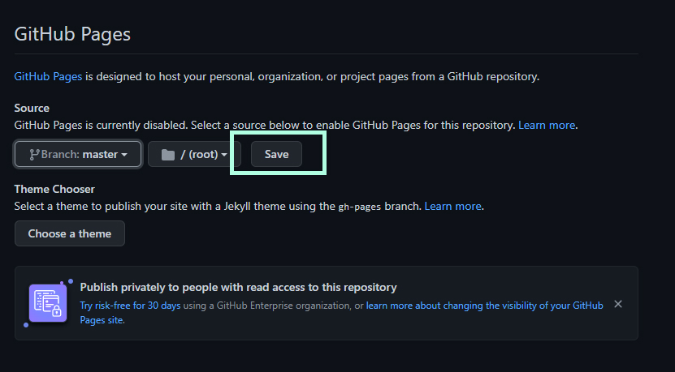

6. After a minute, your website will be available at the following link

   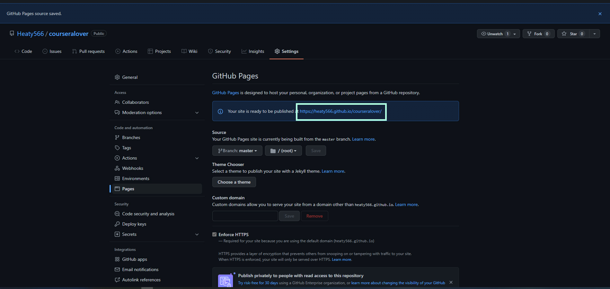

7. The website will be rebuilt when you push a commit to that GitHub repository

### 3.2 NextJS Project

Note: we will use the static export feature of NextJS framework to create our project, so we can not use some of the features of NextJS, which are explained in this link: https://nextjs.org/docs/advanced-features/static-html-export#unsupported-features

1. Create NextJS project and init GitHub repository
2. Write code
3. Add the script in [nextjskit/package.json](nextjskit/package.json) in this repository to your package.json

   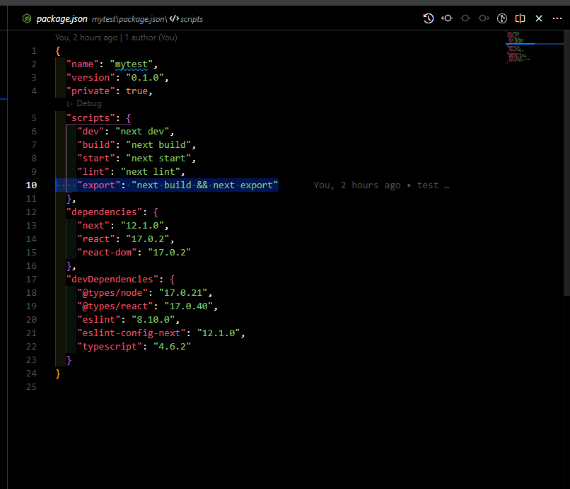

4. copy [.github](nextjskit/.github) folder to your root project like the picture below

   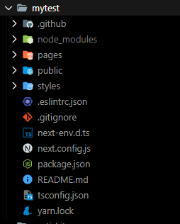

5. Push your code to GitHub and wait for GitHub action to run about 2 minutes
6. Go to the "Settings" section in your project repository

   

7. Click to the "Pages" section

   

8. Select the branch "gh-pages" and save

   

   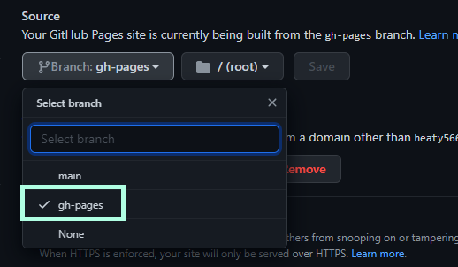

9. After a minute, your website will be available at the following link

Note: The website can not load any CSS or JS, so we need a domain to make it run

## 4. Adding your custom domain

### 4.1 DNS Configuration

In your DNS manager, which may be different by the provider, we need to create 4 A records point to the GitHub server

1. DNS Configuration
   | Type | HostName | Value | TTL (seconds) |
   | ---- | -------- | --------------- | ------------- |
   | A | @ | 185.199.111.153 | 3600 |
   | A | @ | 185.199.110.153 | 3600 |
   | A | @ | 185.199.109.153 | 3600 |
   | A | @ | 185.199.108.153 | 3600 |

   - Digital Oceans DNS Manager example

   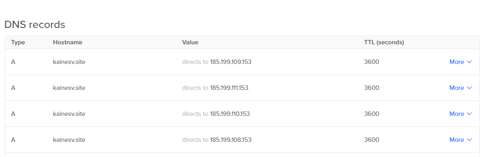

   - GoDaddy DNS Manager example

   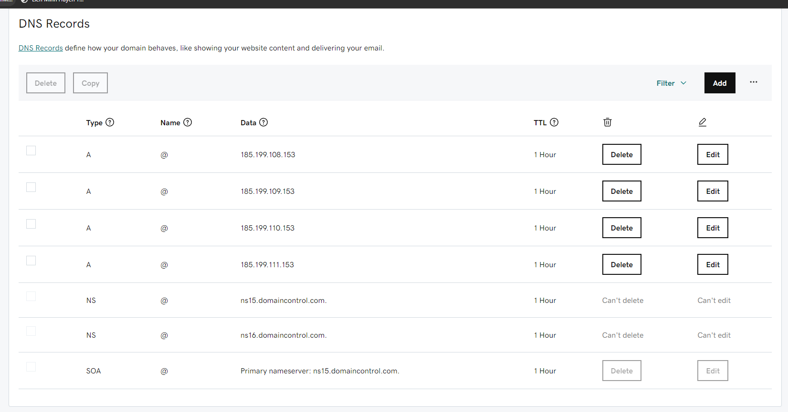

   Note: to check your DNS configure go to https://dnschecker.org, enter your domain and the result should look like this

   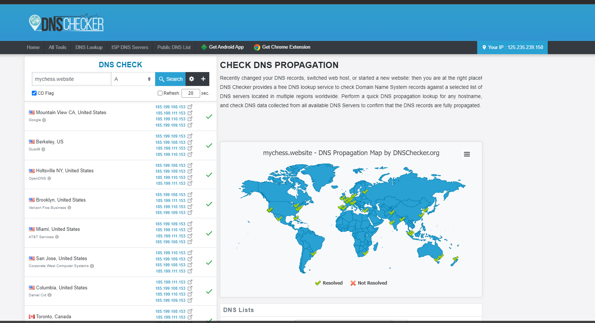

### 4.2 Github Page Configuration

1. Go to "Settings" section in your project repository
2. Click to "Pages" section
3. Enter your custom domain and save (this process can take up to 24h, please patient)

   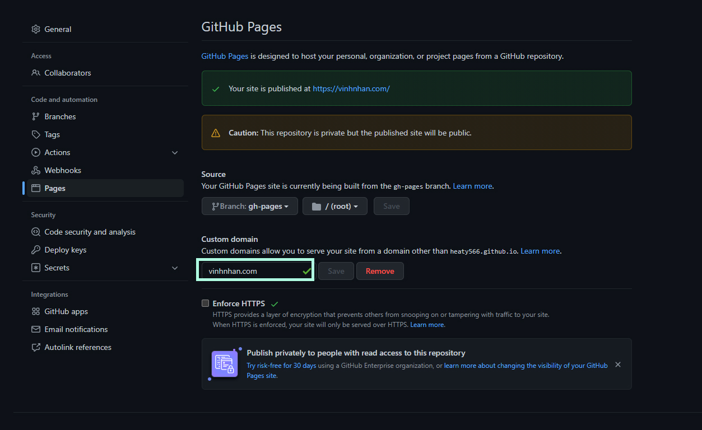

4. After that check "Enforce HTTPS" to enable https to your website

   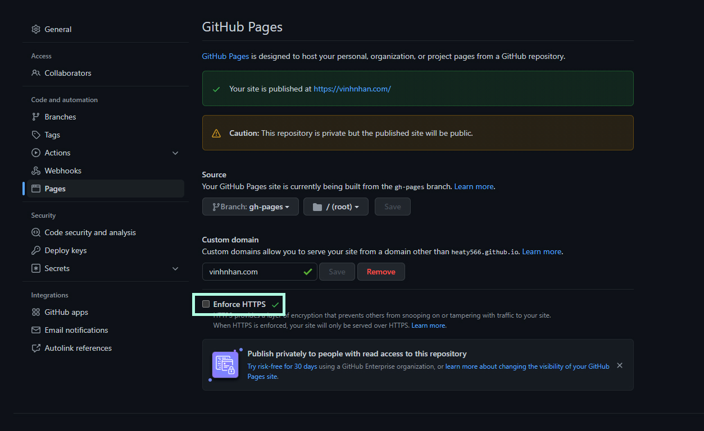

## 5. Update your website

The next time you need to update your website, create a push request to your repository. The website will be rebuilt in about 1-2 minutes.

## 6. Error

Please contact me via FB to get the fastest response: https://www.facebook.com/Heaty566
